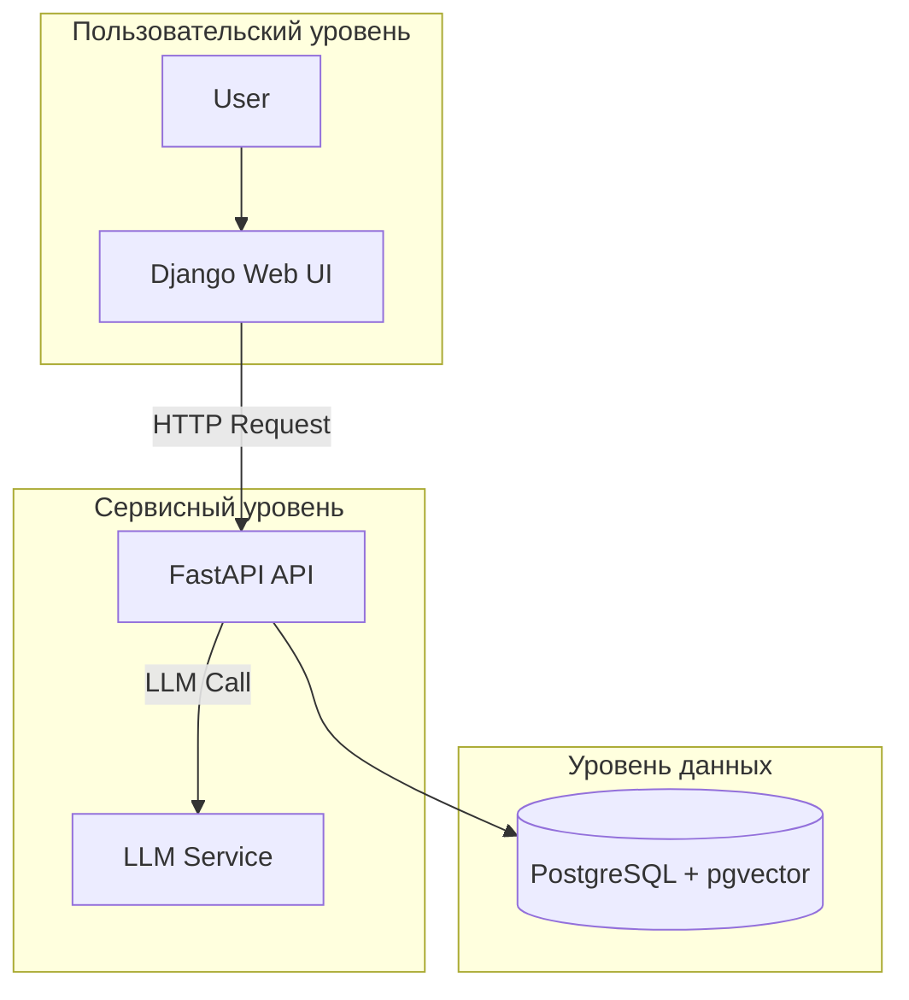

# Спецификация для AI-агентов: RAG-система

Этот документ определяет ключевые архитектурные решения, правила кодирования и команды для работы с проектом RAG-системы.

## 1. Обзор проекта

**Назначение**: Система "Вопрос-Ответ" (RAG) для поиска по большой базе технических документов.

**Технологический стек**:
*   **Бэкенд API**: Python, FastAPI
*   **Веб-интерфейс**: Python, Django
*   **База данных**: PostgreSQL 15 + pgvector
*   **ML-модели**: `microsoft/codebert-base` (эмбеддинги), `BAAI/bge-reranker-v2-m3` (ре-ранжирование)
*   **Окружение**: `virtualenv` + `pip`

**Архитектура**:
Система состоит из двух основных сервисов:
1.  **FastAPI App (`src/api`)**: Асинхронный сервис, отвечающий за всю RAG-логику: прием запросов, гибридный поиск, ре-ранжирование и взаимодействие с LLM.
2.  **Django App (`src/web`)**: Традиционное веб-приложение для аутентификации пользователей и отображения истории запросов.

Оба сервиса работают с единой базой данных PostgreSQL.



---

## 2. Сборка и запуск

**Установка зависимостей**:
Все зависимости управляются через `pyproject.toml`. Для установки используйте:
```bash
# Создать и активировать виртуальное окружение
python3 -m venv .venv
source .venv/bin/activate

# Установить зависимости
pip install -e ".[dev]"
```

#### Установка для GPU

Проект поддерживает два варианта установки зависимостей для GPU:

-   **Для современных GPU (CUDA 12+):**
    ```bash
    pip install -e ".[dev,gpu-modern]"
    ```

-   **Для устаревших GPU (CUDA 11.7, `sm_61`):**
    ```bash
    pip install -e ".[dev,gpu-legacy]" --extra-index-url https://download.pytorch.org/whl/cu117
    ```
    После установки не забудьте установить `RERANKER_ONNX=True` в вашем `.env` файле, чтобы включить ONNX-ускорение.

    **Важно:** В режиме `gpu-legacy` будет работать только модель ре-ранжирования. Модель для создания эмбеддингов (`FlagEmbedding`) требует более новых версий библиотек и не будет установлена.

**Запуск сервисов для разработки**:
*   **FastAPI API**:
    ```bash
    uvicorn src.api.main:app --reload --host 0.0.0.0 --port 8001
    ```
*   **Django Web UI**:
    ```bash
    python src/web/manage.py runserver 0.0.0.0:8000
    ```

---

## 3. Тестирование

**Запуск тестов**:
Для запуска всех тестов (unit и интеграционных) используется `pytest`.
```bash
pytest
```

**Основные тестовые модули**:
*   `tests/test_chunker.py`: Реализованы юнит-тесты для `MarkdownChunker`.
*   `tests/test_api.py`: Реализованы базовые интеграционные тесты для эндпоинта `/api/v1/query` с использованием моков.

---
## 6. Дополнительные инструменты

### HTML to Markdown Converter

Для конвертации HTML-документов в формат Markdown используется специальный инструмент в модуле `src/convert/`. Это позволяет подготовить документы в нужном формате для последующей загрузки в систему.

**Использование CLI**:
```bash
python src/convert/cli.py --input /path/to/html/files --output /path/to/output/markdown/files
```

**Основные особенности конвертера**:
*   Использует `trafilatura` для извлечения основного контента из HTML
*   Применяет `beautifulsoup4` для очистки HTML от нежелательных элементов (навигация, реклама, боковые панели и т.д.)
*   Использует `markdownify` для преобразования очищенного HTML в Markdown
*   Поддерживает многопроцессорную обработку файлов
*   Опционально сохраняет таблицы и отбрасывает изображения

**Модули конвертера**:
*   `src/convert/html2md.py`: Основная логика конвертации
*   `src/convert/cli.py`: CLI-интерфейс для массовой обработки файлов
---

## 4. Стиль кодирования и правила

**Форматирование и линтинг**:
*   **Инструмент**: `ruff`.
*   **Конфигурация**: Находится в `pyproject.toml`.
*   **Команды**:
    ```bash
    # Автоформатирование
    ruff format .

    # Проверка и автоисправление
    ruff check --fix .
    ```

**Основные правила Python**:
*   **Типизация**: Все функции должны иметь строгую типизацию (`mypy`).
*   **Модели данных**: Для работы с БД используется `SQLAlchemy` как единый источник правды. Модели Django (`managed = False`) используются только для интеграции с админ-панелью.
*   **Конфигурация**: Все параметры (ключи, URL, порты) должны считываться из переменных окружения через централизованный Pydantic-объект в `src/config.py`. Не допускается хардкод значений.
*   **Асинхронность**: API-сервис на FastAPI полностью асинхронный. Используйте `async/await` для всех I/O операций.

---

## 5. Работа с базой данных

**Миграции**:
*   Схема БД управляется вручную через DDL-скрипт `scripts/setup_db.sql`.
*   **Важно**: Не используйте `alembic` или `django migrate` для изменения таблиц `documents`, `chunks`, `query_history`. Миграции Django используются только для внутренних моделей (`auth`, `sessions`).

**Получение сессии**:
*   В FastAPI используйте зависимость `Depends(get_db)` для получения сессии SQLAlchemy.
*   В Django для работы с историей используйте стандартный ORM, который работает с `managed = False` моделями.